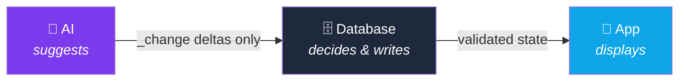

# ⚔️ JOSEPH — Character Sheet

**Class:** Full-Stack Developer · **Subclass:** AI-Native Systems · **Base:** Türkiye 🇹🇷

Solo developer — which mostly means I've personally made, and fixed, every mistake in this stack.

---

## 🎲 Ability Scores

*Self-assessed. No saving throw was rolled. Take with a grain of salt.*

| Stat | Score | Mod | In practice |
|------|:---:|:---:|-------------|
| 💪 **STR** — Stubbornness | 17 | +3 | Years into a solo FRPG engine and still not give up. That's dedication and consistency |
| ⚡ **DEX** — Frontend | 14 | +2 | React Native + Expo on mobile; React, Three.js and GSAP on web |
| 🛡️ **CON** — Backend Endurance | 15 | +2 | 505 Postgres functions and counting. Someone has to maintain them, and that someone is me |
| 🧠 **INT** — System Architecture | 16 | +3 | A +99-table PostgreSQL schema with RLS on every table — no exceptions, no "we'll fix it later" |
| 🔮 **WIS** — AI Engineering | 15 | +2 | LLM pipelines where the AI proposes and the server decides. Learned the hard way why that order matters |
| ✨ **CHA** — Product Sense | 20 | +5 | The table did say *self-assessed*. But baking the free/premium split into the architecture itself? That was a natural 20 |

---

## 📜 Main Quest: Fate of Mind

A mobile-first RPG where an AI acts as the Dungeon Master, following D&D 5e rules — built around one idea: **the AI is not allowed to touch reality.**

The AI never rolls dice and never edits a stat. It writes proposals (`_change` fields); only the server validates them and updates the real state (`_current`). Cheating isn't against the rules — it's structurally impossible. You can't fake a nat 20 when the dice live on the server.

| | |
|---|---|
| ⚙️ **Stack** | React Native 0.81 + Expo 54 · Supabase PostgreSQL + Edge Functions (Deno) · Mistral AI |
| 🗄️ **Numbers** | 112 tables · 505 functions · 272 RLS policies · server-side 4-phase dice |
| 💰 **Modes** |  Sandbox (lightweight) ·  FRPG (full D&D experience) — different cost profiles by design |
| 🎯 **Status** | Pre-launch. Taking my time on purpose — I'd rather ship late than ship with security holes |

---

## 🗡️ Side Quests

**🌌 Togu Nexus** — a community platform with events, forums and role-based moderation. React, TypeScript, Three.js, GSAP — I wanted it to feel like a place, not a webpage. Supabase Realtime keeps the event board live.

**🤬 Turkish Profanity Detection ML** — a pipeline for detecting Turkish profanity and slang, including the creatively misspelled kind. I built the labeled dataset myself; Turkish internet slang mutates fast, and off-the-shelf filters don't stand a chance.

**🎭 Ozan Engine** — a small interactive narrative engine living inside Togu Nexus. Typed, tested, and fun to break.

---

## 🎒 Inventory

---

## 🧭 Alignment

- **Never trust the client** — in games or anywhere else. The player doesn't get to roll their own dice.
- **Documentation is for future me.** He shows up three months later with no memory and a lot of questions.
- **No deadline is a feature.** Use the freedom to get things right, not just done.

---

## 📬 Send a Raven

<!-- Replace USERNAME with your GitHub username and uncomment to activate stats cards:

-->

